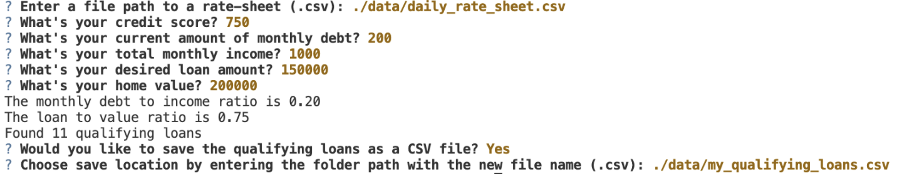

# Loan Qualifier Application

This is a command line application to match applicants with qualifying loans. The application works by using loan criteria from various loan providers (provided by the user), asking the user a number of questions to evaluate their loan eligibility, and returning a list of qualifying loans with the chance to save them as a CSV file.

---

## Technologies

### This project leverages python 3.7 with the following packages:

* [fire](https://github.com/google/python-fire) - For the command line interface, help page, and entrypoint.

* [questionary](https://github.com/tmbo/questionary) - For interactive user prompts and dialogs

* [sys](https://docs.python.org/3/library/sys.html) - To exit the app

* [pathlib](https://docs.python.org/3/library/pathlib.html) - To use file paths

* [tkinter.messagebox](https://docs.python.org/3/library/tkinter.messagebox.html#module-tkinter.messagebox) - For yes or no user prompt


---

## Installation Guide

Before running the application first install the following dependencies.

**Python Fire**

Use the package manager [pip](https://pip.pypa.io/en/stable/) to install Fire

```python
  pip install fire
```

**Python Questionary**

Use the package manager [pip](https://pip.pypa.io/en/stable/) to install Questionary:

```python
  pip install questionary
```

---

## Usage

To use the loan qualifier application you must first clone the repository to your local machine:

```python
git clone <paste link here>
```
 Next you can run the **app.py** with:

```python
python app.py
```   
<br>

When you launch the loan qualifier application you will be greeted with the following prompts.



<br>

**NOTE** The app will exit if:

- CSV path cannot be found
- There are no loans to save
- You do not want to save the qualifying loans

---

## Contributors

Cole Frederick
* fredec96@gmail.com
* [Linkedin](www.linkedin.com/in/cole-frederick-085982b0)

---

## License

Licensed under the 
[MIT](https://github.com/fredec96/Module_2_Challenge/blob/main/LICENSE.md) License.